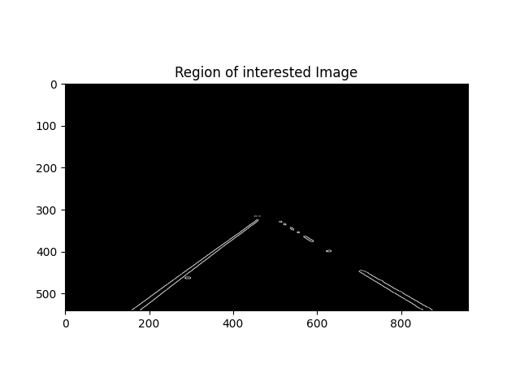

# line_detection
# Şerit Çizgileri Bulma  
Bu projedeki amaç derin öğrenme kullanmadan resim proseslerini kullanarak yol şerit çizgilerini tespit etmektir. Ve böylelikle daha az maliyetle sürecimiz tamamlanmaktadır.
Yolun şeritlerini belirlemek aracı şeridin içinde tutmak için önemlidir. 
Bu aynı zamanda otonom bir aracın gerçekleştirmesi için çok kritik bir görevdir.
Ve basit Bilgisayar Görüntüsü teknikleriyle çok basit Şerit Tespiti mümkündür.Bunu da openCV ile kolayca yapılabilmektedir. 
Bu kodlar, Python ve OpenCV kullanılarak basit şerit tespiti için kullanılabilecek basit şerit hattını gösterecektir.
Paylaşılan a.py ve b.py kodları denenip ve bu kod parçacıklarından yararlanılarak proje yapılmıştır. 
Buradan erişebilirsiniz: https://data-flair.training/blogs/road-lane-line-detection/
Kullanılan resim Resim1 deki gibidir.

           Resim1: Yol Resmi
           

## Renk Seçimi  (Color Selection)
Önce bazı renkler seçilir. Örneğin: Şerit Çizgileri genellikle Beyaz renktedir ve Beyaz'ın RGB değerinin (255,255,255) olduğunu biliyoruz. Burada red_threshold, green_threshold ve blue_threshold değişkenlerinde bir renk eşiği değeri tanımlanır ve rgb_threshold bu değerlerle hesaplanır. Bu vektörde seçilen kırmızı, yeşil ve mavi (R,G,B) için minimum değerleri içerir. Bu ilk adım olarka yol resimine denenir. Burda denenilen yol resmi straight_lines2.jpg doyasındaki resimden yaralanılır. Bu işlemi color_selection.py dosyasındaki gibidir.

           Resim2: Color_selected_Image

## Aralık Maskeleme  (Range Masking)
Görüntüyü çeken öne bakan kameranın, şerit çizgilerinin her zaman görüntünün aynı genel bölgesinde görünecek şekilde arabaya sabit bir konuma monte edildiğini varsayılır. Ardından, şerit çizgilerini bulmayı umduğumuz bölgede renk seçimi için yalnızca pikselleri dikkate alan bir kriter ekleyerek bundan yararlanılır. left_bottom, right_bottom ve apex değişkenleri, diğer her şeyi maskeleyerek renk seçimim için korunması istenilen üçgen bir bölgenin köşelerini temsil ediyor. Burada en basit durumu göstermek için üçgen bir maske kullanılır, ancak bir dörtgen kullanılabilir ve bu prensipte herhangi bir çokgen kullanılabilir. Bu işlemi range_masking.py dosyasındaki gibidir.

           Resim3: Region_Of_Interest

           Resim4: Masked_Color_Selection

           Resim5: Range_Masking           

## Canny Kenar Tespiti (Canny Edge Detection)
Gri ölçekli görüntüye Canny edge detection uygulanarak çıktılar, girdideki görüntülerdeki kenar çizgileri olarak adlandırılan kenar bilgilerini başka bir görüntü olarak elde edilir. Bu tespit edilen kenar bilgileri düşük eşik (low_threshold) ve yüksek eşik (high_thershold) değerlerinden yararlanarak elde edilir. 
 Algoritma önce yüksek eşiğin üzerindeki güçlü kenar (güçlü gradyan) pikselleri algılar ve düşük eşiğin altındaki pikselleri reddeder. Ardından, düşük eşik ve yüksek eşik arasında değerlere sahip pikseller, güçlü kenralara bağlı oldukları sürece dahil edilecektir. Çıktı kenarları, beyaz piksellerin algılanan kenarları takip ettiği ve diğer her yerde siyah olduğu ikili bir görüntüdür.
Bu parametreler için makul aralık olarak en mantıklı yaklaşım için gri tonlamaya dönüştürerek 8 bitlik 2 boyutlu bir görüntü sunar. Bu nedenle 2^8 = 256 olası değer olabilir. Buda 0-255 piksel değerlerini kapsar.
Düşük eşik ile yüksek eşik oranı söz konusu olduğunda, 1:2 veya 1:3 oranları Jhon Canny tarafından önerilmektedir. 
Canny edge detection dan önce gürültüleri ve sahte gradyanları ortalama olarak bastırmanın bir yolu olan Gauss yumuşatmayı da dahil edilir. Cv2.Canny() aslında Gauss yumuşatmasını dahili olarak uygulanılır. Ancak daha fazla yumuşatma uygulanarak farklı bir sonuç elde edilebileceği için buraya dahil edilir. 
Gauss yumuşatma için kernel_size öğesinin herhangi bir tek sayı olarak seçilebilir. Daha büyük kernel_size, daha geniş bir alın üzerinde ortalama alma veya yumuşatma anlamına gelir.Bu işlemi canny_edge_detection.py dosyasındaki gibidir.

           Resim6: Canny_Edge_Detection.jpeg

## İlgi alanı (Region of Interest)
İlgi alanında olmayan canny edge detection sonuçları maskelemede kullanılan bir yöntemdir.
Canny edge detection uygulandıktan sonra bile şerit olmayan birçok kenar algılanır. İlgi alanı, görüntüdeki alnı, ilgilendiğimiz kenarlardan tanımlayan bir çokgendir. 
Buradaki varsayım, ilgili bölgenin tahmin edilebilmesi için kameranın sabit bir yerde kalması ve şeritlerin düz olması için geçerlidir. 
Kısaca araba kamerasının ilgi alanı, yalnızca görüş alanındaki iki şerittir. Diğer yabancı herhangi bir şey değildir. Buda görsele ilgilenilen bir alan oluşturularak ve o alanda olmayan diğer tüm yabancı pikselleri kaldırarak filtrelenir. İlgi alanın önemini Resim7 ile Resim8 arasındaki fark net şekilde görülmektedir. Bu işlemi region_of_interested.py dosyasındaki gibidir.

           Resim7: Canny_Edge_Detection

           Resim8: Region_Of_Interested

## Hough Dönüşümü ve Şerit çizgilerini Algılama (Hough Transform and Detecting lane lines)
Görüntü Uzayında, bir çizgi x’e karşı y olarak çizilir, ancak 1962’de Paul Hough, onun onurunda “Hough Space” adı verilen, parametre uzayında çizgileri temsil etmek için bir yöntem geliştirmiştir. Hough uzayında, (x,y) = (m,b) de bir nokta olarak gösterilmiştir. Hough dönüşümü, görüntü uzayında Hough uzayına dönüşümdür. Dolayısıyla, görüntü uzayındaki bir doğrunun karakterizasyonu, Hough uzayındaki (m,b) konumundaki tek bir nokta olacaktır.
İlgilenilen bölgede kenarları tespit ettiğimizde, şerit çizgilerini gösteren çizgileri belirlemek istenir. Hough dönüşümünün kullanışlı olduğu yer burasıdır. Bu işlemi hough_transfomr.py dosyasındaki gibidir.

           Resim9: Hough Transform

